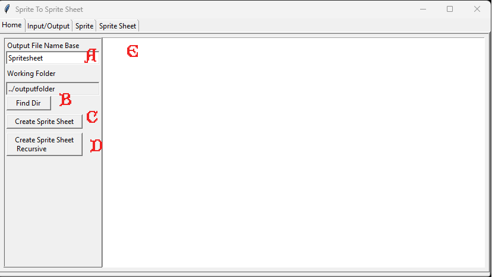
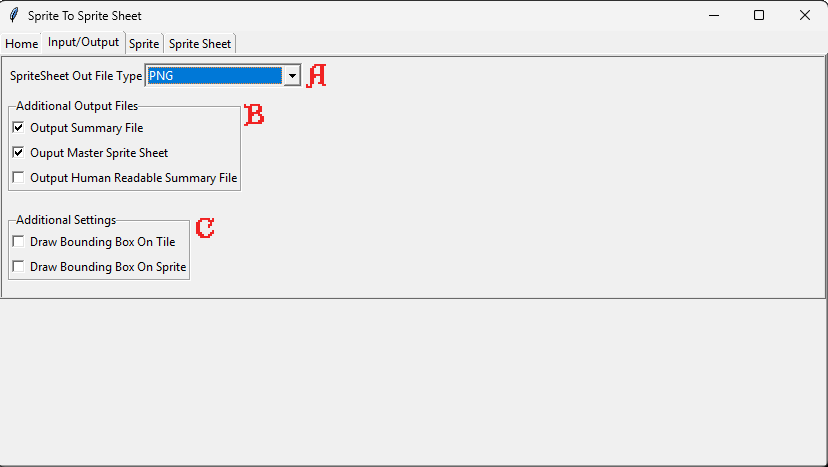
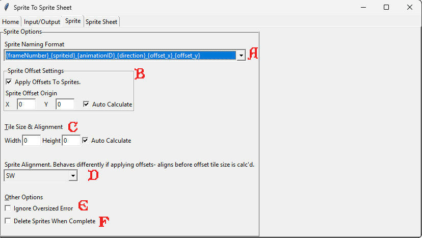
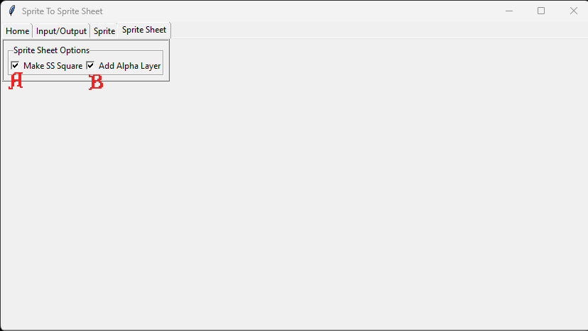

# Sprite To SpriteSheet

## Table of Contents

- [Introduction](#introduction)
- [Requirements](#requirements)
- [The Tool](#the-tool)
- [Workflow](#workflow)

## Introduction
This software was built as part of my workflow to turn sprites into sprite sheets for the purpose of animating them in the Godot game engine. This tool is part of my workflow for getting art from the UO client to being animated in the Godot engine using a custom animation player.  

Given the correct meta data about each sprite, we can animate, layer, and hue weapons, armor, clothing, and mobiles in a way that mimics the UO client while providing more freedom for future growth.
Primarily tested down my desired workflow path. Email Contact at phildoes.dev for feedback.

## Requirements
Written in Python 3.11  
Utilizes several open source Python packages
  - Pillow-11.1.0
  - tkinter (Default version included with Python 3.11)

## The Tool
Home Tab  

  - A
    - The name of the output sprite sheet. Meta data files will hold a reference to this name
    - Defaults to the name of the selected folder to increase speed of workflow
  - B
    - The directory containing sprites that we want to manipulate
    - We also have the option (D) to choose a folder of folders containing sprites and the software will recursively process those folders, applying the name of the folder to the sprite sheet
  - C
    - Create a sprite sheet for the sprites in the selected folder. 
    - Creates a new folder '_SSout' within the sprites folder to place our sprite sheet and meta data.
  - D
    - Loop all folders within the current folder and try to process the sprite within each one. 
    - Invented to process a great number of folders containing sprites at once, allowing me to convert without having to choose each folder individually

Input/Output Tab  

  - A
    - Output file type of the sprite sheet to be created. 
    - Currently PNG vs BMP, implicitly implies a desire for transparency or not
  - B
    - 'Output Summary File'
      - The meta data I use within Godot to animate these sprites
    - 'Output Master Sprite Sheet'
      - A sprite sheet with the frames numbered to help with debugging animation issues
    - 'Output Human Readable Summary File'
      - A version of the summary file that is more cleanly formatted to help with debugging and planning
  - C
    - 'Draw Bounding Box on Tile'
      - Draws a red bounding box on the border of the Sprite Sheet tile for each tile in the Sprite Sheet. A debugging tool.
    - 'Draw Bounding Box on Sprite'
      - Sprite size does not always match tile size, so it is useful to draw this green bounding box around the actual sprite. Allows users to verify positioning for debugging purposes

Sprite Tab  

  - A
    - The software gives the user the ability to choose how much meta data they want to include in the sprite name. The more information included, the more options available.
      - For example, we cannot apply offset or export it as meta data if it is not included.
    - At its most basic level it is a counter that allows the software to place the sprites on the sprite sheet in the correct order.
  - B
    - "Apply Offsets To Sprites" allows us to apply an offset to a sprite within a tile
      - This is a feature that was useful at one time, but became less so with time, but it is easy to imagine how it might become useful again
    - 'Sprite Offset Origin' exists so that we can apply an offset to a sprite within a tile (negative or positive) without bleeding into the next tile
      - Setting this manually allows the user to create a consistent offset origin across sprite sheets so that they might align correctly - if desired. 
      - This did not end up being part of my workflow, but it seems nice
  - C
    - "Tile Size" can be 'Auto-Calculated' based on max sprite sizes and offsets, or set manually, which allows the user to create consistent tiles/sprites across sprite sheets
  - D
    - Default alignment of a sprite within a tile. A tile must be large enough to contain all sprite sizes, so any sprite smaller than the tile will be initially aligned w/in the tile at some location. This setting allows users to choose between: N, NE, E, SE, S, etc.
  - E
    - An error occurs if a sprite draws over a tile's border. We can choose to ignore this error
  - F
    - Sometimes it is nice to delete the sprites after we are done working on them, and sometimes it is desirable to keep them. This gives the user that choice.

Sprite Sheet Tab  

  - A
    - Forces row count to equal column count, making a square sprite sheet
  - B
    - Literally adds an alpha channel to the image when it's being created in Python. 

## Workflow

- Extract sprites along with information such as draw offsets using the [UOFiddler tool](https://github.com/polserver/UOFiddler)

- Run SpriteToSpriteSheet having set the desired [Settings](#the-tool)
- Enjoy your sprite sheet and meta data- ready to be plugged into my custom animation player in Godot (soon to be open sourced).

